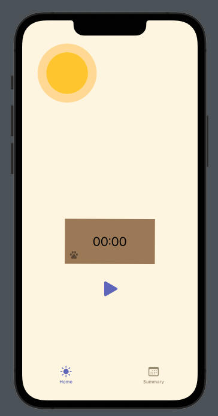
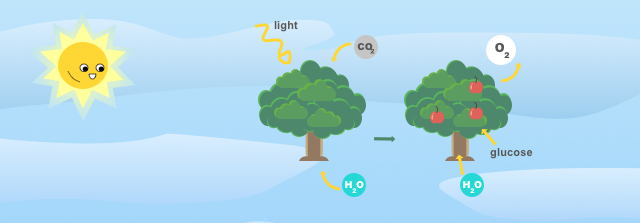

### Greetings 🖖

I'm a software developer with about 7 years of experience. I’ve been working mostly with iOS apps using Swift but I have also worked with some full-stack apps and scripts.

I’ve worked on:
- Apps mobile (iOS) and web (React.js, HTML + CSS, Inferno.js)
- Games (Unity, Swift, SpriteKit, on functional programming language) and interactive scenes (one of them [awarded](https://github.com/MaisaMilena/WWDC18_Photosynthesis) by Apple)
   - [TaelinArena](https://github.com/MaisaMilena/TaelinArena): built on Formality language
   - [Kaelin](https://gist.github.com/MaisaMilena/895903800506c932b533d21797a242f5): built on Formality language. [Gameplay example](https://www.youtube.com/shorts/nf_uj6Dcn5g)
- Scripts to automate tasks locally, on GitHub, and spreadsheets. Mostly Node.js, but also Python and ShellScript
- Scripts to transform data: [images to code](https://github.com/MaisaMilena/Formality-image), [code into animations](https://github.com/MaisaMilena/Formality-Net-Animator), relational database (modeling and ETL), CoreData, etc
- Contribution to open-source projects
- Some posts on [Gist](https://gist.github.com/MaisaMilena) and [Medium](https://medium.com/@maisa.milena)

# 🔭 I’m currently working on
Timer app  

# 👯 Open-sourced apps
[Photosynthesis App](https://github.com/MaisaMilena/WWDC18_Photosynthesis): interactive scene of how photosynthesis phases work  

[Movs](https://github.com/MaisaMilena/ios-recruiting-brazil): app consuming The Movie DB API. Allow creating favorite list and deals with errors.

[My Anime List](https://github.com/MaisaMilena/MyAnimeList): manage anime's list to watch and have watched. Built to demonstrate VIP and gather contributions during Hacktoberfest 2018  

[Job Application Manager](): very simple web app to manage job applications  

